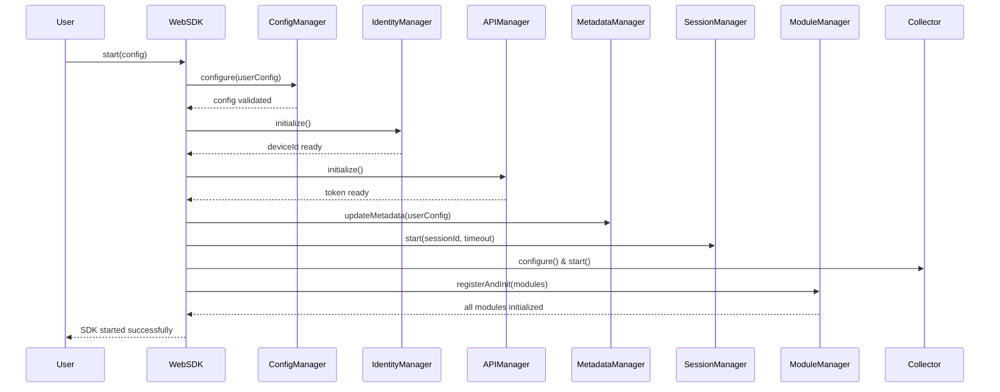
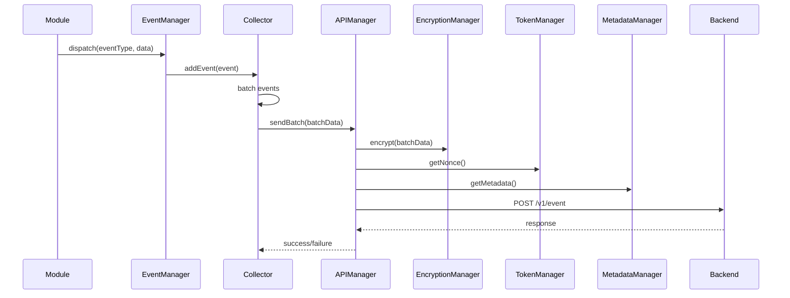
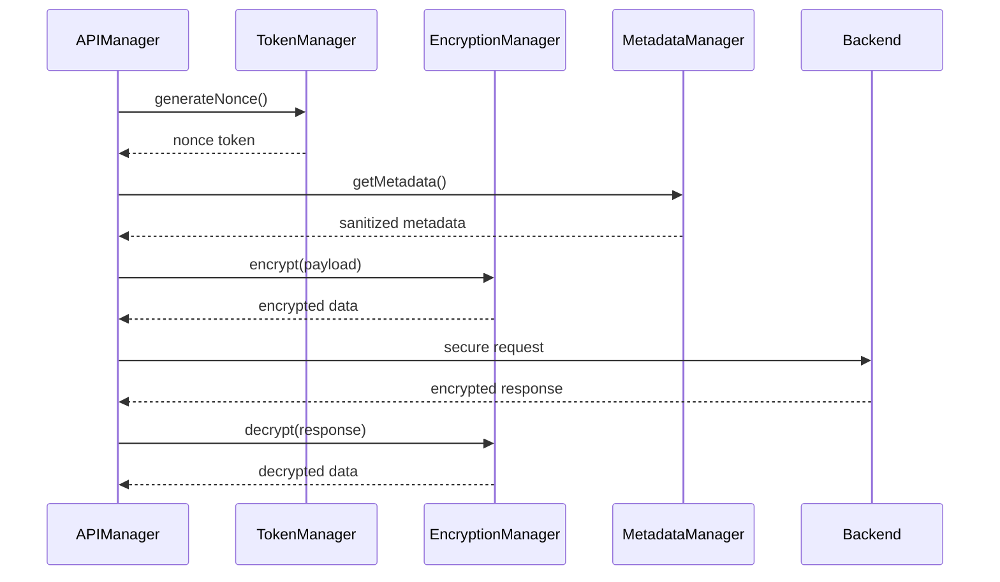

# Web SDK Technical Documentation

## Table of Contents

1. [Architecture Overview](#architecture-overview)
2. [Manager System](#manager-system)
3. [Manager Communication Patterns](#manager-communication-patterns)
4. [Module System](#module-system)
5. [Integration Guide](#integration-guide)
6. [API Reference](#api-reference)
7. [Security Architecture](#security-architecture)
8. [Performance Considerations](#performance-considerations)
9. [Troubleshooting](#troubleshooting)

---

## Architecture Overview

The Web SDK is built on a **manager-based architecture** that provides a secure, scalable, and maintainable framework for behavioral analytics and fraud detection. The system consists of:

- **10 Core Managers**: Each handling specific responsibilities
- **38 Feature Modules**: Collecting behavioral and contextual data
- **Event-Driven Communication**: Asynchronous message passing between components
- **Multi-Layer Security**: Encryption, token management, and validation

### System Components

```
┌─────────────────────────────────────────────────────────────────┐
│                        WebSDK Main Class                        │
│                    (Singleton Instance)                         │
└─────────────────────┬───────────────────────────────────────────┘
                      │
        ┌─────────────┼─────────────┐
        │             │             │
        ▼             ▼             ▼
┌─────────────┐ ┌─────────────┐ ┌─────────────┐
│ConfigManager│ │IdentityMgr  │ │SessionMgr   │
│             │ │             │ │             │
│• Config     │ │• Device ID  │ │• Session    │
│• Validation │ │• Fingerprint │ │• Timeout    │
│• Triggers   │ │• Persistence│ │• State      │
└─────────────┘ └─────────────┘ └─────────────┘
        │             │             │
        ▼             ▼             ▼
┌─────────────┐ ┌─────────────┐ ┌─────────────┐
│ModuleManager│ │Collector   │ │APIManager   │
│             │ │             │ │             │
│• 38 Modules │ │• Batching   │ │• HTTP Comm  │
│• Lifecycle  │ │• Events     │ │• Auth       │
│• Cleanup    │ │• Retry      │ │• Errors     │
└─────────────┘ └─────────────┘ └─────────────┘
        │             │             │
        ▼             ▼             ▼
┌─────────────┐ ┌─────────────┐ ┌─────────────┐
│EventManager │ │MetadataMgr │ │TokenManager │
│             │ │             │ │             │
│• Events     │ │• Metadata   │ │• Nonce      │
│• Listeners  │ │• Sanitize   │ │• Validation │
│• Cleanup    │ │• Export     │ │• Rotation   │
└─────────────┘ └─────────────┘ └─────────────┘
                      │             │
                      ▼             ▼
                ┌─────────────┐ ┌─────────────┐
                │EncryptionMgr│ │38 Modules   │
                │             │ │             │
                │• 4-Layer    │ │• Behavioral │
                │• Key Rotate │ │• Fingerprint│
                │• Security   │ │• Context    │
                └─────────────┘ └─────────────┘
```

### Manager Dependencies

```
ConfigManager (No dependencies)
    ↓
IdentityManager → ConfigManager
    ↓
APIManager → IdentityManager, ConfigManager
    ↓
MetadataManager → IdentityManager, ConfigManager
    ↓
SessionManager → ConfigManager
    ↓
Collector → SessionManager, ConfigManager
    ↓
ModuleManager → EventManager, ConfigManager
    ↓
TokenManager → ConfigManager
    ↓
EncryptionManager → ConfigManager
    ↓
EventManager → ConfigManager
```

---

## Manager System

### Core Managers

#### 1. ConfigManager

**Purpose**: Centralized configuration management and validation

**Responsibilities**:

- Validate and store SDK initialization parameters
- Manage configuration updates and changes
- Provide configuration access to other managers
- Handle configuration-based triggers and callbacks

**Key Features**:

- Configuration validation with TypeScript interfaces
- Immutable configuration objects
- Event-driven configuration updates
- Default value management

**Integration Points**:

- Used by all managers for configuration access
- Triggers SDK shutdown on configuration changes
- Validates user-provided configuration

```typescript
interface SdkInitConfig {
  organizationId: string;
  sessionId: string;
  transactionId: string;
  baseApiUrl: string;
  deviceId?: string;
  sessionDuration?: number;
  trigger?: string;
  metadata?: Record<string, any>;
}
```

#### 2. IdentityManager

**Purpose**: Device identification and fingerprinting

**Responsibilities**:

- Generate and manage unique device identifiers
- Create device fingerprints from hardware/software characteristics
- Maintain device identity across sessions
- Handle device ID persistence and retrieval

**Key Features**:

- Hardware-based device fingerprinting
- Cross-session device identity persistence
- Device ID validation and verification
- Fallback mechanisms for ID generation

**Integration Points**:

- Provides device ID to APIManager for API requests
- Used by MetadataManager for device session tracking
- Referenced by all modules for device identification

#### 3. SessionManager

**Purpose**: Session lifecycle management

**Responsibilities**:

- Track session start/end times
- Manage session timeouts and extensions
- Handle session state transitions
- Provide session information to other components

**Key Features**:

- Automatic session timeout handling
- Session state persistence
- Session event notifications
- Configurable session duration

**Integration Points**:

- Used by Collector for session-based batching
- Referenced by MetadataManager for session tracking
- Triggers cleanup operations on session end

#### 4. ModuleManager

**Purpose**: Feature module lifecycle and coordination

**Responsibilities**:

- Register and initialize all feature modules
- Manage module dependencies and initialization order
- Handle module cleanup and destruction
- Provide module access to shared resources

**Key Features**:

- Dynamic module registration
- Dependency injection for shared managers
- Module lifecycle management
- Error handling and recovery

**Integration Points**:

- Initializes all 38 feature modules
- Provides EventManager access to modules
- Manages module cleanup during shutdown

#### 5. Collector

**Purpose**: Data collection and batching

**Responsibilities**:

- Collect events from all modules
- Batch events for efficient transmission
- Manage collection intervals and thresholds
- Handle data persistence and retry logic

**Key Features**:

- Configurable batch sizes and intervals
- Event deduplication and compression
- Automatic retry mechanisms
- Memory-efficient data structures

**Integration Points**:

- Receives events from EventManager
- Sends batched data to APIManager
- Uses SessionManager for session-based batching

#### 6. APIManager

**Purpose**: Backend communication and data transmission

**Responsibilities**:

- Handle all API communications with backend
- Manage request/response cycles
- Handle authentication and authorization
- Process API errors and retries

**Key Features**:

- RESTful API communication
- Automatic authentication handling
- Request/response logging
- Error handling and retry logic

**Integration Points**:

- Uses TokenManager for authentication
- Uses EncryptionManager for data security
- Uses MetadataManager for request metadata
- Receives data from Collector

#### 7. MetadataManager

**Purpose**: Metadata collection and management

**Responsibilities**:

- Collect and manage session metadata
- Track transaction and event metadata
- Provide metadata for API requests
- Handle metadata validation and sanitization

**Key Features**:

- Comprehensive metadata tracking
- Automatic metadata generation
- Metadata validation and sanitization
- Batch metadata export

**Integration Points**:

- Used by APIManager for request metadata
- Integrates with IdentityManager for device info
- Provides metadata to all modules

#### 8. TokenManager

**Purpose**: Token generation and management

**Responsibilities**:

- Generate and validate nonce tokens
- Manage token lifecycle and expiration
- Handle token rotation and refresh
- Provide secure token storage

**Key Features**:

- Cryptographic token generation
- Automatic token rotation
- Token validation and verification
- Secure token storage

**Integration Points**:

- Used by APIManager for request authentication
- Provides tokens for secure communication
- Integrates with EncryptionManager for token security

#### 9. EncryptionManager

**Purpose**: Multi-layer data encryption

**Responsibilities**:

- Provide multi-layer encryption for sensitive data
- Manage encryption keys and rotation
- Handle encryption/decryption operations
- Ensure data security in transit

**Key Features**:

- 4-layer encryption system
- Automatic key rotation (every 5 minutes)
- Multiple encryption algorithms
- Performance-optimized encryption

**Integration Points**:

- Used by APIManager for data encryption
- Integrates with TokenManager for secure tokens
- Provides encryption services to all managers

#### 10. EventManager

**Purpose**: Event handling and coordination

**Responsibilities**:

- Manage event listeners and handlers
- Coordinate event flow between components
- Handle event cleanup and memory management
- Provide event debugging and logging

**Key Features**:

- Centralized event management
- Automatic event cleanup
- Event debugging and logging
- Memory leak prevention

**Integration Points**:

- Used by all modules for event handling
- Manages event lifecycle across the SDK
- Provides event coordination between managers

---

## Manager Communication Patterns

### 1. Initialization Flow



### 2. Data Collection Flow



### 3. Security Flow



---

## Module System

### Module Architecture

The SDK includes **38 feature modules** organized into categories:

#### Behavioral Modules (12)

- **MouseBehaviourModule**: Mouse movement, clicks, and trajectory analysis
- **KeyboardModule**: Keystroke dynamics and typing patterns
- **TouchModule**: Touch gestures and multi-touch interactions
- **GesturesModule**: Complex gesture recognition
- **PointerModule**: Pointer events and interactions
- **PageMonitoringModule**: Page interaction and navigation tracking
- **VisibilityChangeModule**: Tab visibility and focus tracking
- **SkipToContentModule**: Accessibility interaction patterns
- **FrameRateModule**: Rendering performance and frame rate analysis
- **DeviceOrientationModule**: Device orientation changes
- **ScreenOrientationModule**: Screen orientation tracking
- **AutomationDetectionModule**: Bot and automation detection

#### Fingerprinting Modules (15)

- **BrowserModule**: Browser identification and capabilities
- **DeviceModule**: Hardware and system information
- **CanvasModule**: Canvas rendering fingerprinting
- **WebGLModule**: WebGL context and capabilities
- **AudioModule**: Audio context fingerprinting
- **FontModule**: Font detection and rendering
- **ScreenModule**: Screen properties and characteristics
- **PluginsModule**: Browser plugin detection
- **BrowserTypeModule**: Browser type identification
- **BrowserFeaturesModule**: Browser feature detection
- **BrowserSpeechModule**: Speech synthesis capabilities
- **ClientHintsModule**: Client hints and capabilities
- **MathModule**: Mathematical operation fingerprinting
- **TrueIdModule**: Advanced device identification
- **BindingModule**: JavaScript binding detection

#### Context Modules (8)

- **NetworkModule**: Network connection information
- **TimezoneModule**: Timezone detection and analysis
- **TimezoneAndLanguageModule**: Combined timezone and language
- **MediaModule**: Media device capabilities
- **ReferrerUrlModule**: Referrer URL analysis
- **PrivateBrowserModule**: Private browsing detection
- **MalwareModule**: Malware and security detection
- **TeamViewerFontModule**: Remote desktop detection

#### Detection Modules (3)

- **AdblockModule**: Ad blocker detection
- **PerformanceModule**: Performance metrics collection
- **WebRTCIPModule**: WebRTC IP leak detection

### Module Base Class

All modules extend `BaseModule` which provides:

```typescript
abstract class BaseModule {
  public abstract readonly moduleName: string;
  protected eventManager = EventManager.getInstance();

  public abstract init(): void;

  protected addListener(
    target: EventTarget,
    type: string,
    listener: EventListener
  ): void;
  public destroy(): void;
}
```

### Module Lifecycle

1. **Registration**: Modules are registered with ModuleManager
2. **Initialization**: Each module's `init()` method is called
3. **Data Collection**: Modules collect data and dispatch events
4. **Cleanup**: Modules are destroyed during SDK shutdown

### Detailed Module Overview

#### Behavioral Analysis Modules

**MouseBehaviourModule**

- **Purpose**: Advanced mouse movement and interaction analysis
- **Data Collected**: Trajectory analysis, click patterns, movement speed, hesitation points
- **Use Cases**: Bot detection, user behavior analysis, interaction quality assessment
- **Event Types**: `mousemove`, `mousedown`, `mouseup`, `click`, `dblclick`, `contextmenu`

**KeyboardModule**

- **Purpose**: Keystroke dynamics and typing pattern analysis
- **Data Collected**: Dwell time, flight time, typing speed, error patterns, rhythm analysis
- **Use Cases**: User authentication, bot detection, typing proficiency assessment
- **Event Types**: `behaviour.keyboard.summary`, `behaviour.keyboard.realtime`

**TouchModule**

- **Purpose**: Touch gesture and multi-touch interaction tracking
- **Data Collected**: Touch points, gesture recognition, pressure sensitivity, multi-touch patterns
- **Use Cases**: Mobile device analysis, gesture-based authentication, touch behavior profiling
- **Event Types**: `behaviour.touch`, `touch.start`, `touch.move`, `touch.end`

**GesturesModule**

- **Purpose**: Complex gesture recognition and analysis
- **Data Collected**: Gesture types, timing patterns, accuracy metrics, gesture sequences
- **Use Cases**: Advanced interaction analysis, accessibility assessment, gesture-based security
- **Event Types**: `behaviour.gestures`, `gesture.recognized`, `gesture.completed`

**PointerModule**

- **Purpose**: Pointer events and interaction tracking
- **Data Collected**: Pointer coordinates, pressure, tilt, hover patterns
- **Use Cases**: Input device analysis, precision assessment, interaction quality
- **Event Types**: `behaviour.pointer`, `pointer.move`, `pointer.down`, `pointer.up`

**PageMonitoringModule**

- **Purpose**: Page interaction and navigation tracking
- **Data Collected**: Scroll patterns, page focus, navigation timing, interaction zones
- **Use Cases**: User engagement analysis, page performance assessment, navigation behavior
- **Event Types**: `behaviour.page-monitoring`, `page.scroll`, `page.focus`, `page.blur`

**VisibilityChangeModule**

- **Purpose**: Tab visibility and focus tracking
- **Data Collected**: Visibility state changes, focus duration, background activity
- **Use Cases**: User attention analysis, session quality assessment, multitasking detection
- **Event Types**: `behaviour.visibility-change`, `visibility.hidden`, `visibility.visible`

**SkipToContentModule**

- **Purpose**: Accessibility interaction pattern analysis
- **Data Collected**: Skip link usage, accessibility tool interactions, navigation patterns
- **Use Cases**: Accessibility compliance, user assistance analysis, inclusive design assessment
- **Event Types**: `behaviour.skip-to-content`, `skip.activated`, `skip.navigated`

**FrameRateModule**

- **Purpose**: Rendering performance and frame rate analysis
- **Data Collected**: Frame rates, rendering performance, animation smoothness, GPU utilization
- **Use Cases**: Performance monitoring, device capability assessment, optimization analysis
- **Event Types**: `metrics.frame-rate`, `frame.dropped`, `frame.rendered`

**DeviceOrientationModule**

- **Purpose**: Device orientation change tracking
- **Data Collected**: Orientation changes, accelerometer data, gyroscope readings, orientation timing
- **Use Cases**: Mobile device analysis, orientation-based interactions, device stability assessment
- **Event Types**: `context.device-orientation`, `orientation.changed`, `orientation.stable`

**ScreenOrientationModule**

- **Purpose**: Screen orientation tracking
- **Data Collected**: Screen orientation changes, aspect ratio changes, orientation preferences
- **Use Cases**: Display analysis, orientation-based UI assessment, device configuration analysis
- **Event Types**: `context.screen-orientation`, `screen.orientation.changed`

**AutomationDetectionModule**

- **Purpose**: Bot and automation detection
- **Data Collected**: Automation signatures, bot patterns, headless browser detection, automation tools
- **Use Cases**: Fraud prevention, bot detection, security analysis, quality assurance
- **Event Types**: `detection.automation`, `automation.detected`, `bot.signature`

#### Device Fingerprinting Modules

**BrowserModule**

- **Purpose**: Browser identification and capability detection
- **Data Collected**: User agent, browser features, plugin information, hardware capabilities
- **Use Cases**: Browser compatibility, feature detection, browser fingerprinting
- **Event Types**: `fingerprint.browser`, `browser.capabilities`, `browser.features`

**DeviceModule**

- **Purpose**: Hardware and system information collection
- **Data Collected**: GPU information, hardware concurrency, device memory, system specifications
- **Use Cases**: Device identification, capability assessment, hardware fingerprinting
- **Event Types**: `device`, `device.gpu`, `device.hardware`

**CanvasModule**

- **Purpose**: Canvas rendering fingerprinting
- **Data Collected**: Canvas rendering differences, font rendering, image processing, rendering artifacts
- **Use Cases**: Device fingerprinting, browser identification, rendering engine analysis
- **Event Types**: `fingerprint.canvas`, `canvas.2d`, `canvas.webgl`

**WebGLModule**

- **Purpose**: WebGL context and capability detection
- **Data Collected**: WebGL parameters, shader capabilities, texture limits, extension support
- **Use Cases**: GPU fingerprinting, graphics capability assessment, WebGL compatibility
- **Event Types**: `fingerprint.webGL`, `webgl.context`, `webgl.extensions`

**AudioModule**

- **Purpose**: Audio context fingerprinting
- **Data Collected**: Audio processing characteristics, frequency analysis, audio hardware signatures
- **Use Cases**: Device fingerprinting, audio capability assessment, hardware identification
- **Event Types**: `fingerprint.audio`, `audio.context`, `audio.analysis`

**FontModule**

- **Purpose**: Font detection and rendering analysis
- **Data Collected**: Available fonts, font rendering differences, font metrics, typography capabilities
- **Use Cases**: Device fingerprinting, font compatibility, typography analysis
- **Event Types**: `fingerprint.font`, `font.available`, `font.rendering`

**ScreenModule**

- **Purpose**: Screen properties and characteristics
- **Data Collected**: Screen dimensions, color depth, pixel density, display capabilities
- **Use Cases**: Display analysis, device identification, screen capability assessment
- **Event Types**: `fingerprint.screen`, `screen.properties`, `screen.capabilities`

**PluginsModule**

- **Purpose**: Browser plugin detection
- **Data Collected**: Installed plugins, plugin versions, MIME types, plugin capabilities
- **Use Cases**: Browser fingerprinting, plugin compatibility, security assessment
- **Event Types**: `fingerprint.plugins`, `plugin.detected`, `plugin.capabilities`

**BrowserTypeModule**

- **Purpose**: Browser type identification
- **Data Collected**: Browser engine, version information, rendering engine, browser family
- **Use Cases**: Browser compatibility, version detection, engine identification
- **Event Types**: `fingerprint.browser-type`, `browser.type`, `browser.version`

**BrowserFeaturesModule**

- **Purpose**: Browser feature detection
- **Data Collected**: Feature support, API availability, capability detection, feature flags
- **Use Cases**: Feature compatibility, capability assessment, progressive enhancement
- **Event Types**: `fingerprint.browser-features`, `feature.detected`, `feature.supported`

**BrowserSpeechModule**

- **Purpose**: Speech synthesis capability detection
- **Data Collected**: Speech synthesis capabilities, voice options, speech engine information
- **Use Cases**: Accessibility analysis, speech capability assessment, voice interaction analysis
- **Event Types**: `context.browser-speech`, `speech.synthesis`, `speech.voices`

**ClientHintsModule**

- **Purpose**: Client hints and capability detection
- **Data Collected**: Client hints, device capabilities, network information, user preferences
- **Use Cases**: Capability detection, optimization hints, user preference analysis
- **Event Types**: `context.client-hints`, `hint.device`, `hint.network`

**MathModule**

- **Purpose**: Mathematical operation fingerprinting
- **Data Collected**: Math operation results, precision differences, calculation artifacts
- **Use Cases**: Device fingerprinting, precision analysis, mathematical capability assessment
- **Event Types**: `fingerprint.math`, `math.operations`, `math.precision`

**TrueIdModule**

- **Purpose**: Advanced device identification
- **Data Collected**: Unique device signatures, hardware fingerprints, device characteristics
- **Use Cases**: Device identification, fraud prevention, device tracking
- **Event Types**: `fingerprint.trueid`, `device.signature`, `device.unique`

**BindingModule**

- **Purpose**: JavaScript binding detection
- **Data Collected**: JavaScript engine characteristics, binding behavior, engine-specific features
- **Use Cases**: Engine identification, binding analysis, JavaScript capability assessment
- **Event Types**: `context.binding`, `binding.detected`, `binding.characteristics`

#### Context and Environment Modules

**NetworkModule**

- **Purpose**: Network connection information
- **Data Collected**: Connection type, speed, latency, network characteristics
- **Use Cases**: Network analysis, performance optimization, connection quality assessment
- **Event Types**: `context.network`, `network.connection`, `network.quality`

**TimezoneModule**

- **Purpose**: Timezone detection and analysis
- **Data Collected**: Timezone information, offset data, timezone changes, daylight saving
- **Use Cases**: Geographic analysis, timezone compliance, temporal behavior analysis
- **Event Types**: `context.timezone`, `timezone.detected`, `timezone.offset`

**TimezoneAndLanguageModule**

- **Purpose**: Combined timezone and language analysis
- **Data Collected**: Timezone and language combinations, regional preferences, cultural indicators
- **Use Cases**: Regional analysis, cultural assessment, localization analysis
- **Event Types**: `context.timezone-language`, `region.detected`, `culture.indicators`

**MediaModule**

- **Purpose**: Media device capability detection
- **Data Collected**: Media device information, camera capabilities, microphone access, media permissions
- **Use Cases**: Media capability assessment, device analysis, permission tracking
- **Event Types**: `context.media`, `media.devices`, `media.permissions`

**ReferrerUrlModule**

- **Purpose**: Referrer URL analysis
- **Data Collected**: Referrer information, traffic sources, navigation patterns, external links
- **Use Cases**: Traffic analysis, source tracking, navigation behavior assessment
- **Event Types**: `context.referrer-url`, `referrer.detected`, `source.analysis`

**PrivateBrowserModule**

- **Purpose**: Private browsing detection
- **Data Collected**: Private browsing indicators, incognito mode detection, privacy settings
- **Use Cases**: Privacy analysis, browsing mode detection, privacy compliance assessment
- **Event Types**: `detection.private-browser`, `privacy.mode`, `incognito.detected`

**MalwareModule**

- **Purpose**: Malware and security detection
- **Data Collected**: Security indicators, malware signatures, security threats, protection status
- **Use Cases**: Security analysis, threat detection, security compliance assessment
- **Event Types**: `detection.malware`, `security.threat`, `malware.detected`

**TeamViewerFontModule**

- **Purpose**: Remote desktop detection
- **Data Collected**: Remote desktop indicators, TeamViewer signatures, remote access detection
- **Use Cases**: Remote access detection, security analysis, remote desktop identification
- **Event Types**: `detection.team-viewer-font`, `remote.desktop`, `teamviewer.detected`

#### Detection and Analysis Modules

**AdblockModule**

- **Purpose**: Ad blocker detection
- **Data Collected**: Ad blocker presence, blocking behavior, privacy tool detection
- **Use Cases**: Ad blocker analysis, privacy tool detection, blocking behavior assessment
- **Event Types**: `adblock`, `adblock.detected`, `blocker.present`

**PerformanceModule**

- **Purpose**: Performance metrics collection
- **Data Collected**: Performance metrics, timing data, resource usage, optimization indicators
- **Use Cases**: Performance monitoring, optimization analysis, resource usage assessment
- **Event Types**: `metrics.performance`, `performance.timing`, `resource.usage`

**WebRTCIPModule**

- **Purpose**: WebRTC IP leak detection
- **Data Collected**: IP address information, network configuration, VPN detection, proxy detection
- **Use Cases**: Network analysis, VPN detection, proxy identification, IP leak analysis
- **Event Types**: `context.webrtc.ips`, `ip.detected`, `network.configuration`

---

## Integration Guide

### Basic Integration

```typescript
import { WebSDK } from "./web-SDK";

// Initialize the SDK
const sdk = WebSDK.getInstance();

// Configure the SDK
const config = {
  organizationId: "org-123",
  sessionId: "session-456",
  transactionId: "txn-789",
  baseApiUrl: "https://api.example.com",
  deviceId: "device-abc", // Optional
  sessionDuration: 3600, // Optional, in seconds
  trigger: '{"#trigger":"submit"}', // Optional
  metadata: {
    // Optional
    userId: "user-123",
    customField: "value",
  },
};

// Start the SDK
await sdk.start(config);

// SDK is now collecting data automatically
```

### Advanced Integration

```typescript
// Access individual managers
const metadataManager = sdk.getMetadataManager();
const tokenManager = sdk.getTokenManager();
const encryptionManager = sdk.getEncryptionManager();
const apiManager = sdk.getAPIManager();

// Custom metadata management
metadataManager.setMetadata("customField", "value", "source");
metadataManager.updateMetadata({ field1: "value1", field2: "value2" });

// Token management
const nonce = tokenManager.generateNonce("session-details");
const isValid = tokenManager.validateNonce(nonce);

// Data encryption
const sensitiveData = { username: "user", password: "pass" };
const encrypted = encryptionManager.encrypt(sensitiveData);

// Manual API calls
const response = await apiManager.sendData("endpoint", encryptedData);
```

### Event Handling

```typescript
// Listen to SDK events
sdk.on("module:initialized", (moduleName) => {
  console.log(`Module ${moduleName} initialized`);
});

sdk.on("data:collected", (data) => {
  console.log("Data collected:", data);
});

sdk.on("error", (error) => {
  console.error("SDK error:", error);
});
```

---

## API Reference

### WebSDK Class

#### Methods

```typescript
class WebSDK {
  // Singleton access
  static getInstance(): WebSDK;

  // Lifecycle management
  async start(userConfig: SdkInitConfig): Promise<void>;
  shutdown(): void;

  // Manager access
  getMetadataManager(): MetadataManager;
  getTokenManager(): TokenManager;
  getEncryptionManager(): EncryptionManager;
  getAPIManager(): APIManager;

  // Event handling
  on(event: string, callback: Function): void;
  off(event: string, callback: Function): void;
  emit(event: string, data: any): void;
}
```

### Configuration Interface

```typescript
interface SdkInitConfig {
  organizationId: string; // Required: Organization identifier
  sessionId: string; // Required: Session identifier
  transactionId: string; // Required: Transaction identifier
  baseApiUrl: string; // Required: Backend API URL
  deviceId?: string; // Optional: Device identifier
  sessionDuration?: number; // Optional: Session timeout in seconds
  trigger?: string; // Optional: Trigger configuration JSON
  metadata?: Record<string, any>; // Optional: Additional metadata
}
```

### Event Types

```typescript
// Module events
"module:initialized"; // Module successfully initialized
"module:error"; // Module initialization failed
"module:destroyed"; // Module cleanup completed

// Data events
"data:collected"; // Data collected from module
"data:batched"; // Data batched for transmission
"data:sent"; // Data successfully sent to backend
"data:failed"; // Data transmission failed

// Session events
"session:started"; // Session started
"session:ended"; // Session ended
"session:timeout"; // Session timeout

// Security events
"token:generated"; // New token generated
"token:expired"; // Token expired
"encryption:rotated"; // Encryption key rotated

// Error events
"error"; // General error
"error:network"; // Network error
"error:validation"; // Validation error
```

---

## Security Architecture

### Multi-Layer Encryption

The SDK implements a 4-layer encryption system:

1. **Primary Layer**: XOR encryption with rotating keys
2. **Secondary Layer**: Base64 encoding with obfuscation
3. **Tertiary Layer**: Custom character shifting algorithm
4. **Quaternary Layer**: Final hex obfuscation layer

### Token Management

- **Nonce Tokens**: Short-lived (5 minutes) for request security
- **Session Tokens**: Medium-lived (1 hour) for session management
- **Auth Tokens**: Medium-lived (1 hour) for API authentication
- **Refresh Tokens**: Long-lived (24 hours) for token renewal

### Data Protection

- **Encryption in Transit**: All data encrypted before transmission
- **Metadata Sanitization**: Sensitive data removed from metadata
- **Secure Storage**: Tokens and keys stored securely
- **Automatic Cleanup**: Sensitive data cleared on shutdown

---

## Performance Considerations

### Memory Management

- **Singleton Pattern**: Reduces memory usage across managers
- **Event Cleanup**: Automatic cleanup of event listeners
- **Batch Processing**: Efficient data batching reduces memory overhead
- **Garbage Collection**: Proper cleanup prevents memory leaks

### Network Optimization

- **Batch Transmission**: Events batched for efficient network usage
- **Compression**: Data compressed before transmission
- **Retry Logic**: Intelligent retry mechanisms for failed requests
- **Connection Pooling**: Reuse of HTTP connections

### CPU Optimization

- **Asynchronous Processing**: Non-blocking operations
- **Debounced Collection**: Prevents excessive CPU usage
- **Background Processing**: Heavy operations run in background
- **Efficient Algorithms**: Optimized data processing algorithms

---

## Troubleshooting

### Common Issues

#### 1. SDK Initialization Failed

```typescript
// Check configuration
const config = {
  organizationId: "valid-org-id",
  sessionId: "valid-session-id",
  transactionId: "valid-transaction-id",
  baseApiUrl: "https://valid-api-url.com",
};

// Verify network connectivity
fetch(config.baseApiUrl + "/health")
  .then((response) => console.log("API accessible"))
  .catch((error) => console.error("API not accessible:", error));
```

#### 2. Module Not Collecting Data

```typescript
// Check module initialization
sdk.on("module:initialized", (moduleName) => {
  console.log(`Module ${moduleName} initialized`);
});

sdk.on("module:error", (error) => {
  console.error("Module error:", error);
});
```

#### 3. Data Not Being Sent

```typescript
// Check collector status
const collector = sdk.getCollector();
console.log("Collector status:", collector.getStatus());

// Check API manager
const apiManager = sdk.getAPIManager();
console.log("API manager status:", apiManager.getStatus());
```

#### 4. Token Issues

```typescript
// Check token status
const tokenManager = sdk.getTokenManager();
const nonce = tokenManager.getNonce();
console.log("Current nonce:", nonce);

// Validate token
const isValid = tokenManager.validateNonce(nonce);
console.log("Token valid:", isValid);
```

### Debug Mode

Enable debug mode for detailed logging:

```typescript
// Set debug mode
localStorage.setItem("websdk-debug", "true");

// Debug information will be logged to console
console.log("[WebSDK Debug] Module initialized:", moduleName);
console.log("[WebSDK Debug] Data collected:", data);
console.log("[WebSDK Debug] API request:", request);
```

### Performance Monitoring

Monitor SDK performance:

```typescript
// Get performance metrics
const metrics = sdk.getPerformanceMetrics();
console.log("Memory usage:", metrics.memoryUsage);
console.log("Event count:", metrics.eventCount);
console.log("API calls:", metrics.apiCalls);
console.log("Error count:", metrics.errorCount);
```

---

## Conclusion

The Web SDK provides a comprehensive, secure, and performant solution for behavioral analytics and fraud detection. The manager-based architecture ensures scalability and maintainability, while the extensive module system provides detailed insights into user behavior and device characteristics.

For additional support or questions, refer to the individual module documentation files or contact the development team.
